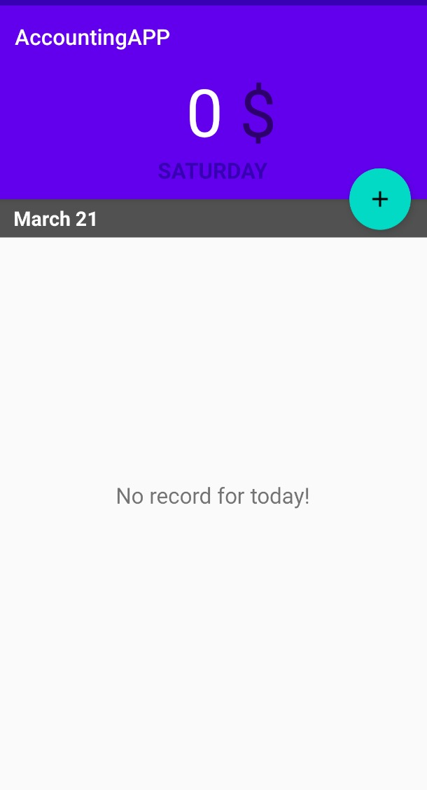

# AccountingApp
This is an Android App helping people record and keep track of their accounting information.

## Instruction
User can record incomes and expenses on a daily basis. The App also allows user to costomize the category, amount and remark of each record which can be edited or deleted after being created.

## Display
Here is the Main interface after initiating the app:
 

 
By clicking the green button, it would send an intent to initiate the next activity. It is startActivityForResult(intent) that is supposed to be called, because it helps update the database and ListView in main activity.
 
Then, here is the interface of AddRecord activity:
 

 

User can select the expense amount and the category in the RecyclerView. They can also edit the remark of each record through the EditText view. All of these data would be saved and managed by SQLite database. I implimented the getInstance() method to in GlobalUtil class to offer the context to other classes and an access to the database at the mean time.
 
 
Here is one added record of the day and the total expense would show in the TickerView.
 

 
 
As user long click one of the record, the app offer two options: Edit and Delete. Edit would lead to add record activity as its uuid remains; Delete would delete the record both in ListView and the database.
 

 
 
User is also allowed to check previous records through swiping, which utilizes the PagerView API.
 

 
